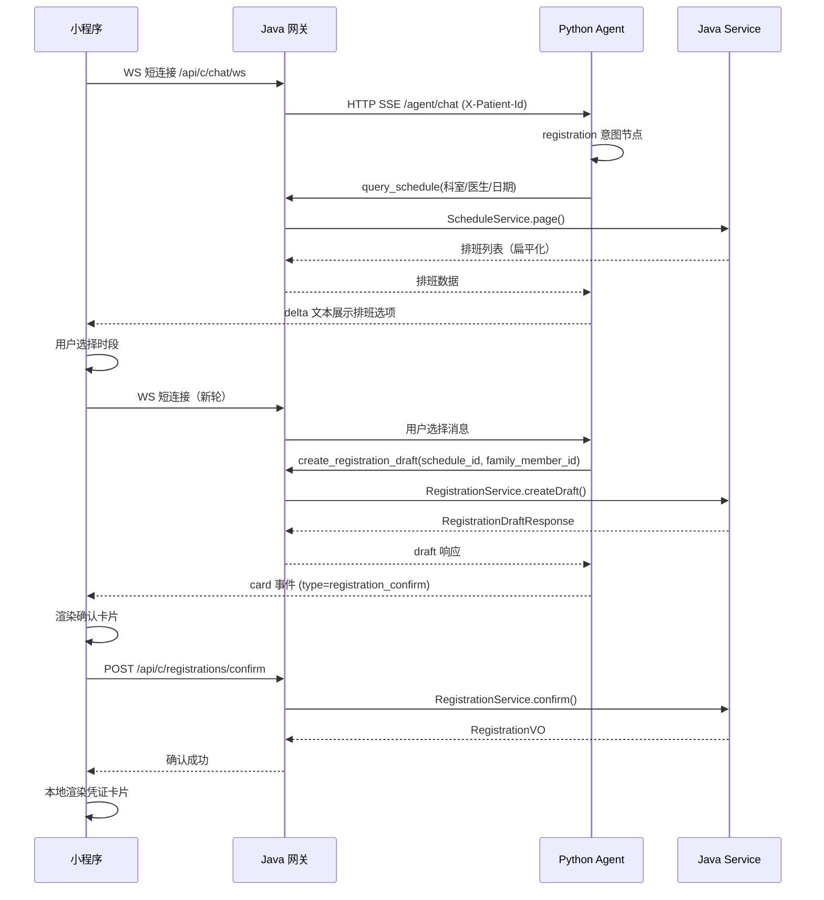

# Ticket 12 — Agent 预约挂号 设计文档

> 基于 `.scratch/smartmed/issues/12-agent-registration.md` 的验收标准，结合 ADR-0015/0016/0014 的决策落盘

## 1. 概述

**目标：** 导诊完成后（或用户直接表达挂号意图时），Agent 引导患者查询排班、选择时段、创建挂号草稿，前端渲染确认卡片，用户点击确认后完成挂号。

**约束：**
- Agent 只建草稿不确认（ADR-0015）
- handler 复用既有 Service 层（ADR-0016）
- 卡片事件遵循 5 事件协议（ADR-0014）
- Java 不解析业务语义，仅透传

## 2. 架构



## 3. 数据流

### 3.1 query_schedule 工具

**输入参数：**
```json
{
  "doctor_id": 1,      // 可选
  "department_id": 1,  // 可选
  "date": "2026-08-05" // 可选
}
```

**返回格式（扁平列表）：**
```json
[
  {
    "scheduleId": 1,
    "doctorId": 1,
    "doctorName": "张医生",
    "departmentId": 1,
    "departmentName": "神经内科",
    "scheduleDate": "2026-08-05",
    "timePeriod": "MORNING",
    "timeRange": "08:00-12:00",
    "remainingSlots": 5,
    "status": "PUBLISHED"
  }
]
```

**过滤规则：** 过滤掉 `status=SUSPENDED` 和 `remainingSlots=0` 的排班，按日期升序排列。

### 3.2 create_registration_draft 工具

**输入参数：**
```json
{
  "schedule_id": 1,
  "family_member_id": null  // 可选，null=本人就诊
}
```

**委托路径：** AgentToolDispatcher → 从请求上下文提取 `patientId`（X-Patient-Id header）→ `registrationService.createDraft(patientId, request)`

**返回格式（增强的草稿响应）：**
```json
{
  "draftKey": "reg_draft:1:1:1",
  "confirmToken": "xxx",
  "scheduleId": 1,
  "doctorName": "张医生",
  "departmentName": "神经内科",
  "scheduleDate": "2026-08-05",
  "timePeriod": "MORNING",
  "timeRange": "08:00-12:00",
  "visitorName": "本人"  // 或家人姓名
}
```

### 3.3 确认卡片事件

```python
card_event(
    card_type="registration_confirm",
    title="确认挂号信息",
    action="/api/c/registrations/confirm",
    payload={
        "scheduleId": 1,
        "confirmToken": "xxx",
        "familyMemberId": null,
        "doctorName": "张医生",
        "departmentName": "神经内科",
        "scheduleDate": "2026-08-05",
        "timePeriod": "MORNING",
        "timeRange": "08:00-12:00",
        "visitorName": "本人"
    }
)
```

前端渲染时隐藏 `confirmToken`、`draftKey`、`scheduleId`、`familyMemberId`，展示其余字段。

## 4. 文件变更清单

### 4.1 Java 后端

| 文件 | 变更 |
|------|------|
| `AgentToolDispatcher.java` | 新增 `query_schedule` 和 `create_registration_draft` handler |
| `RegistrationDraftResponse.java` | 新增 `scheduleDate`/`timePeriod`/`timeRange`/`visitorName` 字段 |
| `ScheduleService.java` | 新增 `queryForAgent()` 方法：返回扁平列表，过滤 SUSPENDED/余量0 |
| `AgentSecretFilter.java` | 从 X-Patient-Id header 提取 patientId 注入请求上下文 |

### 4.2 Python Agent

| 文件 | 变更 |
|------|------|
| `registration.py` | **新建** — 挂号意图节点编排 |
| `intents.py` | 修改 `build_intent_node("registration")` 注入真实节点 |
| `main.py` | 无需修改（graph.py 自动装配 llm） |

### 4.3 前端 miniapp

| 文件 | 变更 |
|------|------|
| `chat/index.js` | onCard 回调增强：确认成功后渲染凭证卡片 |
| `chat/index.axml` | 隐藏 `scheduleId`/`familyMemberId`；新增凭证卡片模板 |

### 4.4 测试

| 文件 | 变更 |
|------|------|
| `agent/tests/test_registration.py` | **新建** — 挂号流程 pytest 测试 |
| `backend/src/test/.../AgentGatewayIntegrationTest.java` | 补充集成测试 |

## 5. 错误处理

| 场景 | 处理方式 |
|------|---------|
| 号源刚被抢完 | Java 返回 400 → Agent 收到 RuntimeError → 文本告知用户"该时段已约满，请重新选择" |
| 草稿已过期 | 用户点击确认时，Java confirm 返回 400 → 前端 toast "草稿已过期" → 用户自然语言重新发起 |
| 排班已停诊 | Java 返回 400 → Agent 文本提示"该排班已停诊，请选择其他时段" |
| 用户没选择就继续 | 确定性编排输出"请从以上排班中选择一个时段" |

## 6. 不纳入范围

- 就诊提醒调度（Agent 仅文案提示"就诊前 1 天会提醒您"）
- 多科室对比（用户选择科室后，Agent 只查该科室排班）
- 号源锁定（草稿不锁号源，确认时扣减）

## 7. 验收标准

- [ ] Java 工具实现：query_schedule（按科室/医生/日期查可用排班和余量，返回扁平列表）
- [ ] Java 工具实现：create_registration_draft（委托 RegistrationService.createDraft，X-Patient-Id 注入身份）
- [ ] Agent 展示排班选项 → 用户选择 → 调用草稿工具 → 生成确认卡片（card 事件）
- [ ] 确认卡片内容：type=registration_confirm + payload 含完整草稿信息
- [ ] 用户确认 → 前端直调 /api/c/registrations/confirm → 成功前端本地渲染凭证卡片
- [ ] 号源刚被抢完 → 前端 toast 提示 → 用户自然语言重新发起 → Agent 重查排班
- [ ] 帮家人挂号：Agent 通过 get_medical_record 确认 family_member_id
- [ ] Agent 挂号成功文案提示"就诊前 1 天会提醒您"
- [ ] pytest 测试：正常挂号流程、号源不足场景、草稿过期场景