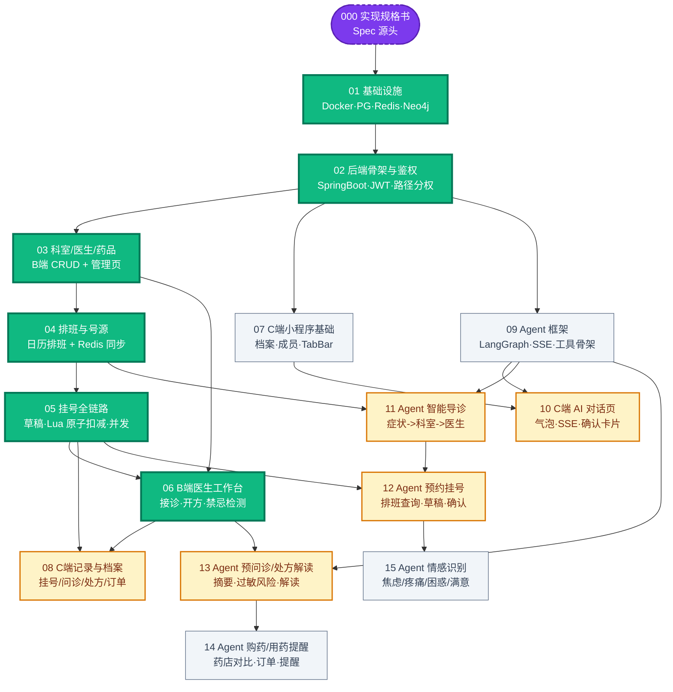
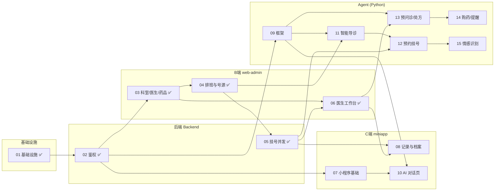

# Ticket 依赖关系图

> 数据来源：`.scratch/smartmed/issues/` 下 17 个文件（`000` 规格书 + `01`–`15` 实现 ticket + `08b` 为 `08` 的追加 bug issue，非独立实现 ticket），依赖关系取自各文件头部 `**Blocked by:**` 字段。
> 生成日期：2026-07-30；最近更新：2026-08-03。完成进度以 git 分支 `feat/NN-*` 是否合并到 master 为准。

## 总览

- **Tickets 总数**：17 个文件 = 1 个规格书（`000`）+ 15 个实现 ticket（`01`–`15`）+ 1 个追加 bug issue（`08b`，从属于 `08`）。
- **完成进度**：6/15 已完成（`01`–`06`，均已合并 master 且经 code-review 修复），剩余 9 个未开始。
- **结构**：以 `02` 为枢纽的 DAG；6 个双依赖 ticket（`06`/`08`/`10`/`11`/`12`/`13`）中 `06` 已完成，剩余 `08`/`10`/`11`/`12`/`13` 为关键汇合点。
- **当前可立即并行启动**：`07`、`08`、`09`（`07`/`09` 只依赖已完成的 `02`；`08` 依赖的 `05`/`06` 均已就绪）。

## 图 1：依赖关系 DAG（核心图）

箭头方向 = 执行顺序（前置 → 后继），即 `Blocked by` 的反向。

**图例**：🟪紫虚线 = 规格书 ｜ 🟩绿粗边 = 已完成 ｜ 🟨橙边 = 双依赖汇合点（关键卡点）｜ ⬜灰 = 未开始

## 图 2：按四端分组的泳道视图（模块归属 + 跨端依赖）

同一泳道内可串行推进，跨泳道边即模块间的握手点。

## 依赖明细表

| Ticket | Blocked by | 依赖数 | 端归属 | 状态 |
|--------|-----------|:---:|--------|------|
| 01 基础设施 | - | 0 | 基建 | ✅ 完成 |
| 02 后端骨架鉴权 | 01 | 1 | 后端 | ✅ 完成 |
| 03 科室/医生/药品 | 02 | 1 | 后端+B端 | ✅ 完成 |
| 04 排班与号源 | 03 | 1 | 后端+B端 | ✅ 完成 |
| 05 挂号全链路 | 04 | 1 | 后端 | ✅ 完成 |
| 06 医生工作台 | **03, 05** | 2 | B端 | ✅ 完成 |
| 07 小程序基础 | 02 | 1 | C端 | ⏳ 可启动 |
| 08 C端记录与档案 | **05, 06** | 2 | C端 | ⏳ 可启动 |
| 09 Agent 框架 | 02 | 1 | 后端+Agent | ⏳ 可启动 |
| 10 C端 AI 对话页 | **07, 09** | 2 | C端 | 待 07/09 |
| 11 Agent 智能导诊 | **09, 04** | 2 | Agent | 待 09 |
| 12 Agent 预约挂号 | **11, 05** | 2 | Agent | 待 11 |
| 13 Agent 预问诊/处方 | **09, 06** | 2 | Agent | 待 09 |
| 14 Agent 购药/提醒 | 13 | 1 | Agent | 待 13 |
| 15 Agent 情感识别 | 12 | 1 | Agent | 待 12 |

## 四端目录归属

| 目录 | 起步 ticket | 后续迭代 ticket |
|------|------------|----------------|
| `backend/` | 02 | 03 / 04 / 05 / 06 / 09 / 13 / 14 |
| `web-admin/` | 03 | 04 / 06 |
| `miniapp/` | 07 | 08 / 10 |
| `agent/` | 09 | 11 / 12 / 13 / 14 / 15 |

四个目录均由 `01` 基础设施 ticket 占位（含 `README.md` + `.gitkeep`），实际骨架由各自起步 ticket 初始化。

## 关键洞察

1. **关键路径（决定最短工期）**：`01 → 02 → 03 → 04 → 05 → 06` 已全部完成；剩余最长链为 `09 → 11 → 12 → 15`（4 个 ticket），次长链 `09 → 13 → 14`。汇合点 `13`（Agent+B端）与 `10`（C端+Agent）是剩余风险最高处。

2. **三条并行主干**（`01–06` 完成后分叉）：
   - C端支线：`07 → 10`（`07` 可立即启动，等 `09` 汇合）
   - Agent 支线：`09 → 11 / 13`（`09` 可立即启动；`11` 依赖的 `04`、`13` 依赖的 `06` 均已就绪）
   - 记录支线：`08` 可立即启动（`05`/`06` 已就绪），为 C 端后续页面提供数据

3. **汇合点 = 联调风险点**：`10`（C端+Agent）、`13`（Agent+B端工作台）--这两个 ticket 的跨端依赖均未就绪，是剩余跨模块握手最容易出现接口不对齐的地方；`11`/`12` 的后端依赖（`04`/`05`）已就绪，风险下降。建议 `09` 收尾时锁定 SSE 事件协议与工具契约，`13` 实现前确认 pre_diagnosis 写入结构（`06` 已按 CONTEXT §10 留 null 占位）。

## 相关 ADR

- `docs/adr/0001-pgvector-dimension-1536.md`：向量维度锁 1536（对齐通义千问 text-embedding-v2），对应 `01` 的 pgvector 表预建。
- `docs/adr/0002-drug-pharmacy-stock-bridge-table.md`：新增 `drug_pharmacy_stock` 桥表（第 20 张表），承载药店-药品-库存-定价，对应 `14` 购药对比数据来源。
- `docs/adr/0003-auth-single-jwt-typ-claim.md`：单种 JWT + `typ` 声明 + 路径分权鉴权模型，对应 `02` 鉴权实现。
- `docs/adr/0004-b-login-by-phone.md`：B 端登录改手机号 + 首登改密，对应 `03` 登录返工。
- `docs/adr/0005-doctor-account-linkage-single-source-phone.md`：医生账号联动 + 手机号单源镜像，对应 `03`。
- `docs/adr/0006-physical-delete-with-preflight-check.md`：物理删除 + 前置引用检查，对应 `03` 三实体删除。
- `docs/adr/0007-b-web-jwt-localstorage.md`：B 端 JWT 存 localStorage 方案，对应 `03` B 端工程初始化。
- `docs/adr/0008-flyway-database-migration.md`：Flyway 接管数据库迁移，对应 `01`/`03` 迁移脚本。
- `docs/adr/0009-schedule-slot-management.md`：排班时段枚举 + 号源管理规则，对应 `04`。
- `docs/adr/0010-registration-family-member-dual-fk.md`：家人挂号双 FK 口径，对应 `05`。
- `docs/adr/0011-consultation-auto-create-on-registration.md`：确认挂号自动创建问诊，对应 `06`。
- `docs/adr/0012-contraindication-check-strategy.md`：开方禁忌检测策略，对应 `06`。

## 维护说明

- 本图由 ticket 文件的 `Blocked by` 字段自动还原，**新增/调整 ticket 依赖时需同步更新本文档**。
- 完成状态以 git 分支 `feat/NN-*` 是否合并到 master 为准；合并后请把对应节点在图 1 中从 `todo`/`merge` 类移到 `done` 类，并在标题加 ✅。
